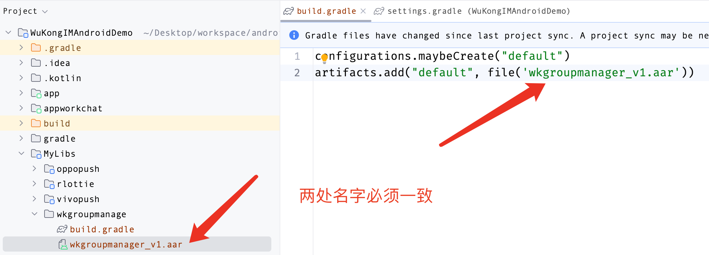

 ### AAR（执行文件）引入

如果你购买了唐僧叨叨的收费模块，也可以通过以下步骤将该模块引入到项目中。下面以`wkgroupmanage`（群管理模块）举例

 #### 第一步

 在项目的`MyLibs`目录中新建文件夹`wkgroupmanage`，将`wkgroupmanager_v1.aar`文件复制到该目录下。并在`wkgroupmanage`文件夹下新建`build.gradle`文件，将以下代码复制到该文件中。

 ```gradle
 configurations.maybeCreate("default")
artifacts.add("default", file('wkgroupmanager_v1.aar'))
 ```

 注意：file名称必须和aar文件名称一致。如下图所示


#### 第二步

在项目的`settings.gradle`文件的最后面添加
```gradle
include ':MyLibs:wkgroupmanager'
```
#### 第三步
在项目的`app`模块的`build.gradle`文件中添加以下代码，并执行`Sync Now`
```gradle
implementation project(path: ':MyLibs:wkgroupmanage')
```
如下图所示


#### 第四步

在项目的`app`模块的`Application`中引入该模块
```kotlin
// 引入群管理模块
WKGroupManageApplication.getInstance().init()
```
完成以上步骤通过aar文件添加模块就完成了