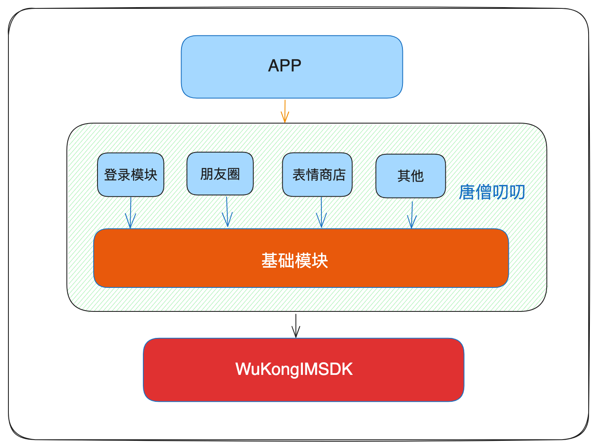

# 介绍

唐僧叨叨Android是模块化结构，不限制开发者编码习惯。模块开发的目的就是在`app`主model中一句代码引入模块。如：`wklogin`模块在主程序的`application` 中注入模块`WKLoginApplication.getInstance().init(this)`

## 项目架构

1. 项目启动骨架 依赖 唐僧叨叨层。

2. 唐僧叨叨内部其他模块都依赖基础模块(`wkbase`)，多个模块组成唐僧叨叨层。

3. 唐僧叨叨通讯层依赖[悟空IM](https://githubim.com)