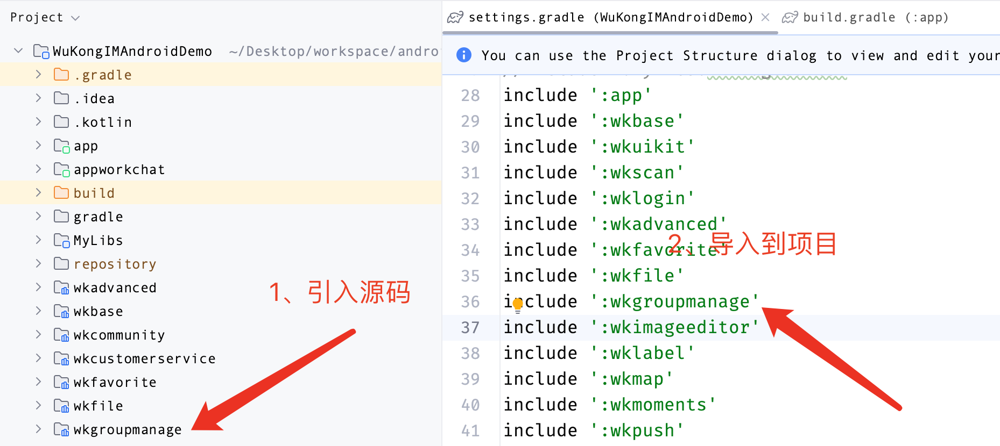
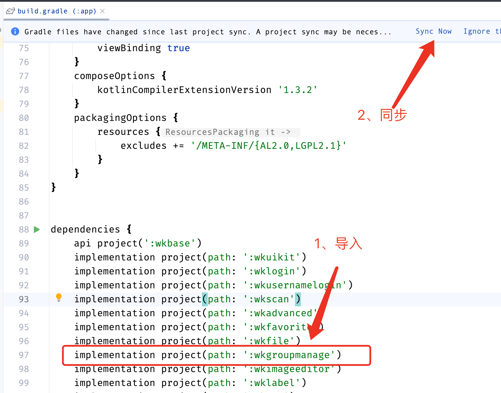

# 模块开发
 为了方便业务开发唐僧叨叨采用了模块开发。不同模块处理独立的业务功能，可以独立使用，也可以组合使用。设计达到的目的就是为了方便在`app`模块通过一句配置就能引入模块。如：`wklogin`模块在主程序的`application` 中注入模块`WKLoginApplication.getInstance().init(this)`

 如果您需要自己开发一个新的模块功能可以按照唐僧叨叨目前的模块设计开发属于自己的模块。当然如果你购买了唐僧叨叨的收费模块，也可以通过以下步骤将该模块引入到项目中。下面以`wkgroupmanage`（群管理模块）举例

 ### AAR（执行文件）引入
 #### 第一步

 在项目的`MyLibs`目录中新建文件夹`wkgroupmanage`，将`wkgroupmanager_v1.aar`文件复制到该目录下。并在`wkgroupmanage`文件夹下新建`build.gradle`文件，将以下代码复制到该文件中。

 ```shell
 configurations.maybeCreate("default")
artifacts.add("default", file('wkgroupmanager_v1.aar'))
 ```

 注意：file名称必须和aar文件名称一致。如下图所示


#### 第二步

在项目的`settings.gradle`文件的最后面添加
```shell
include ':MyLibs:wkgroupmanager'
```
#### 第三步
在项目的`app`模块的`build.gradle`文件中添加以下代码，并执行`Sync Now`
```shell
implementation project(path: ':MyLibs:wkgroupmanage')
```
如下图所示


#### 第四步

在项目的`app`模块的`Application`中引入该模块
```kotlin
// 引入群管理模块
WKGroupManageApplication.getInstance().init()
```
完成以上步骤通过aar文件添加模块就完成了

### 源码引入
#### 第一步

将`wkgroupmanage`源码文件夹放在项目的根目录，并在项目的`settings.gradle`文件的最后面添加该模块
```shell
include ':wkgroupmanage'
```

如下图所示


#### 第二步

在项目的`app`模块的`build.gradle`文件中添加该模块，并执行`Sync Now`
```shell
implementation project(path: ':wkgroupmanage')
```
如下图所示



#### 第三步

在项目的`app`模块的`Application`中引入该模块
```kotlin
// 引入群管理模块
WKGroupManageApplication.getInstance().init()
```
完成以上步骤通过源码添加模块就完成了