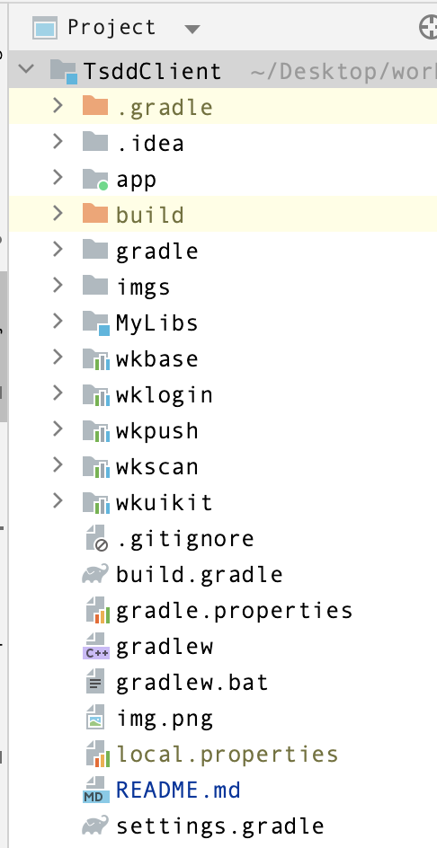

# 项目结构

**`app`**
主模块 模块入口，包含app的启动页，程序所有权限注册，各个模块的初始化，初始化API地址

**`wkbase`**

基础模块 里面包含了`WKBaseApplication`文件，该文件主要是对一些通用工具做些初始化功能，如：网络库初始化，本地db文件初始化等。`WKChatBaseProvider`聊天中重要的基础消息item提供者，所有消息item均继承于此类，里面处理消息气泡样式，头像显示样式，消息间距等很多统一且重要的功能

**`wkuikit`**

聊天模块 包含了聊天页面`ChatActivity`，该文件处理了聊天信息的展示，离线获取，刷新消息状态等聊天中遇到的各个场景。`ChatFragment` 最近会话列表，新消息红点，聊天最后一条消息展示等。此模块还包括app首页信息，联系人信息，我的页面等

**`wklogin`**

登录模块 包含登陆注册，第三方授权登录，修改账号密码，授权pc/web登录等功能，实现其他方式登录可在此模块进行二次开发

**`wkpush`**

推送模块  唐僧叨叨集成了`华为`,`小米`,`vivo`,`oppo`厂商推送功能。开发者二次开发是只需要替换对应的appID和appKey即可
- **华为** 在官方申请开发者账号并开通推送服务后，下载`agconnect-services.json`文件覆盖`app`模块下的该文件。并在`wkpush`模块的 `AndroidManifest.xml` 文件中的名为`com.huawei.hms.client.appid`的`meta-data`替换appID，`PushKeys`文件中替换`huaweiAPPID`即可

- **小米** 修改此模块下的`PushKeys`文件中的`xiaoMiAppID` 和 `xiaoMiAppKey`即可

- **OPPO** 修改此模块下的`PushKeys`文件中的`oppoAppKey` 和 `oppoAppSecret`即可

- **VIVO** 修改此模块`AndroidManifest.xml` 文件中的名为`com.vivo.push.api_key`的`meta-data`的value 和修改名为`com.vivo.push.app_id`的`meta-data`的value即可

由于开发有限，如需其他厂商的推送功能，只需在此模块按官方文档集成即可

 **`wkscan`**

扫一扫模块 包含扫描二维码进行加好友，加入群聊等
