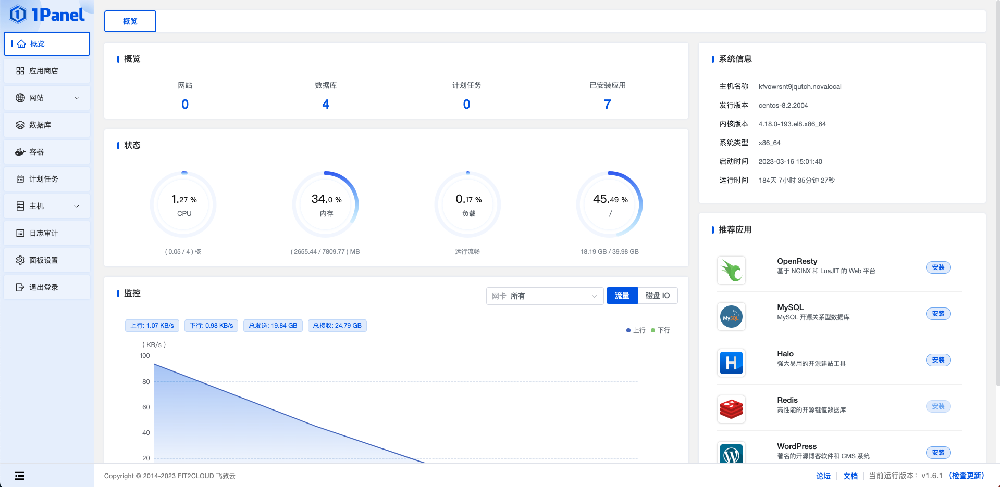
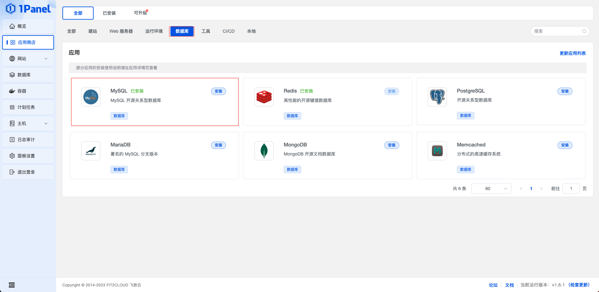
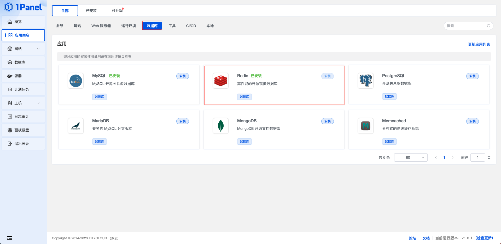
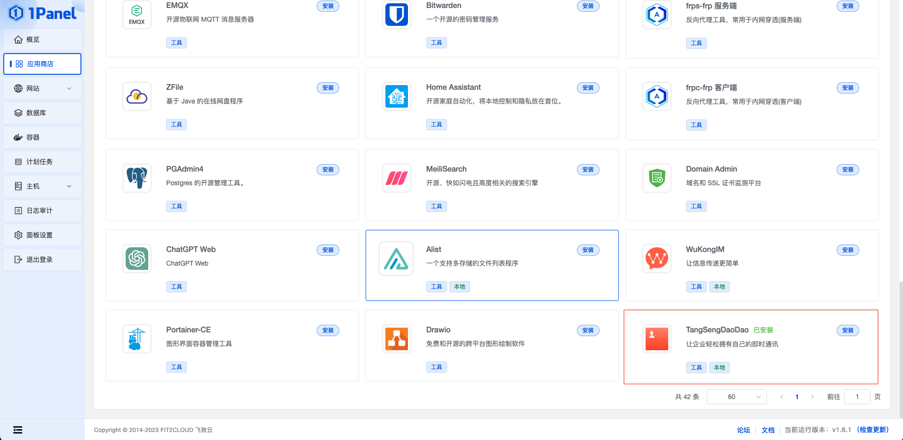
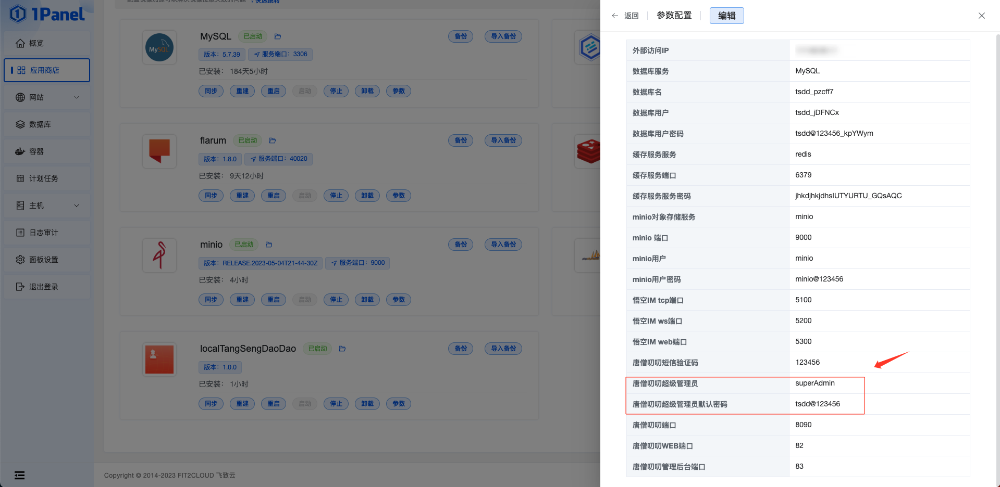
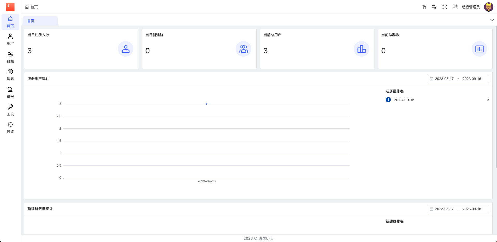
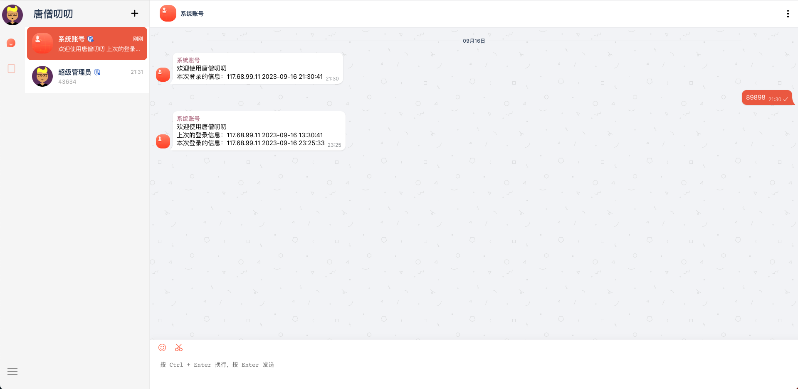

# 1Panel 部署

## 安装 1Panel

在线安装
::: code-group

``` shell [RedHat/CentOS]
curl -sSL https://resource.fit2cloud.com/1panel/package/quick_start.sh -o quick_start.sh && sh quick_start.sh
```

``` shell [Ubuntu/Deepin]
curl -sSL https://resource.fit2cloud.com/1panel/package/quick_start.sh -o quick_start.sh && sudo bash quick_start.sh
```

```shell [Debian]
curl -sSL https://resource.fit2cloud.com/1panel/package/quick_start.sh -o quick_start.sh && sudo bash quick_start.sh
```

关于 1Panel 的安装部署与基础功能介绍，请参考 [1Panel 官方文档](https://1panel.cn/)。在完成了 1Panel 的安装部署后，根据提示网址打开浏览器进入 1Panel，如下界面。



## 安装基础软件

在安装 唐僧叨叨 之前，我们需要先在 1Panel 上安装好所需的软件，包括 MySQL 、Redis 和 Minio。安装部署如下：

### 安装 MySQL 数据库

在应用商店中选择 MySQL 点击安装



### 安装 Redis

在应用商店中选择 Redis 点击安装



### 安装 Minio

在应用商店中选择 Minio 点击安装


## 安装 TangSengDaoDao

安装好 MySQL 、Redis 和 Minio 后，进入应用商店应用列表，找到 TangSengDaoDao 应用进行安装



## 访问 TangSengDaoDao

### 访问悟空IM监控

::: tip 提醒
* 在浏览器访问地址：http:// IP + : +悟空IM监控端口 + /web
* 悟空IM监控端口：默认端口5300
:::


### 访问唐僧叨叨管理后台

::: tip 提醒
* 在浏览器访问地址：http:// IP + : + 唐僧叨叨管理后台端口
* 唐僧叨叨管理后台端口：默认端口83
:::

1. 登录界面


2. 查看超级管理员帐号并进行登录



3. 登录成功



### 访问唐僧叨叨WEB端口

::: tip 提醒
* 在浏览器访问地址：http:// IP + : + 唐僧叨叨WEB端口
* 唐僧叨叨WEB端口：默认端口83
:::

1. 登录界面


2. 登录成功


