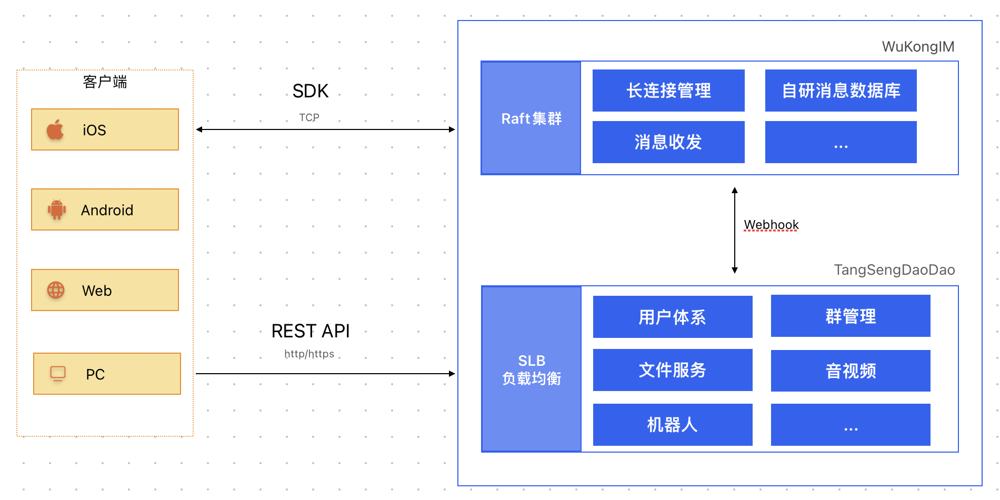
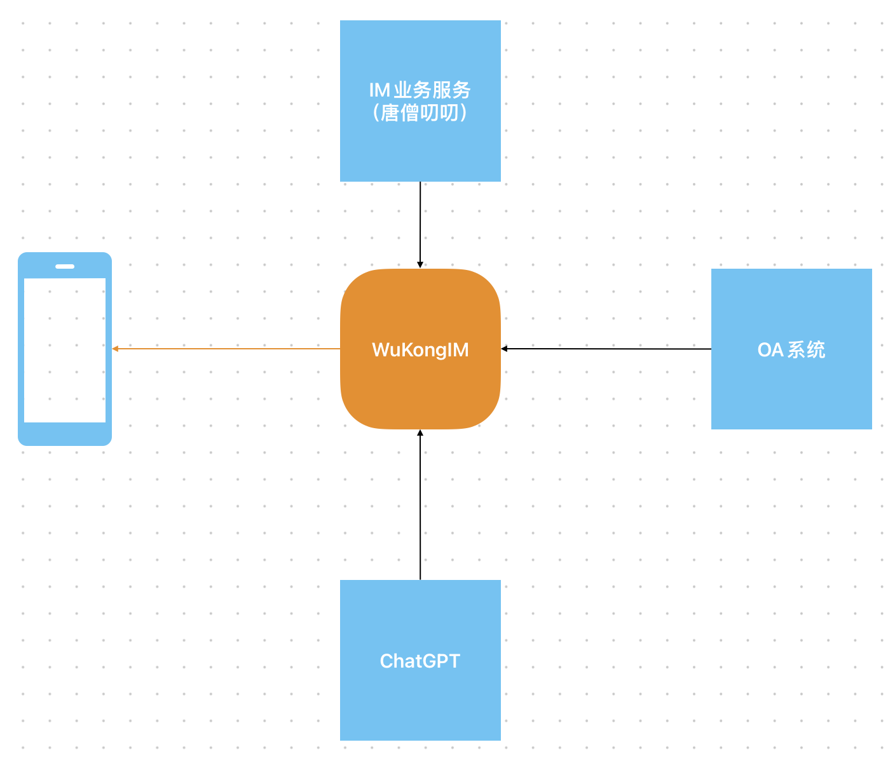

# 项目架构

## 整体架构

整体架构1

采用大道至简的设计原则，我们尽最大的努力让架构简单化，让开发者上手成本和学习成本大大降低。

我们的架构设计原则：`简洁化`、`可扩展性`、`高可用`

整个系统分为二层：`通讯层`(WuKongIM)、`业务层`(TangSengDaoDao)

`通讯层`(WuKongIM)： 负责长连接维护，消息投递，消息高效存储等等

`业务层`(TangSengDaoDao)： 负责一些业务逻辑，比如：好友关系，群组，朋友圈等等，一些IM相关的业务层的逻辑

`通讯层与业务层`： WuKongIM会将一些业务层需要的聊天相关的数据通过Webhook的机制（GRPC）推送给TangSengDaoDao，TangSengDaoDao需要投递一些系统消息时，将调用WuKongIM的发送消息的API进行投递。

`客户端与服务端`： 客户端通过SDK与WuKongIM建立长连接，发送消息和收消息都将通过长连接进行传输，客户端的一些业务逻辑，比如：好友关系，群组，朋友圈等等，将通过调用TangSengDaoDao的API进行处理。

`主要用到的技术： Golang，MYSQL，Redis`

## 不仅仅是即时通讯

WuKongIM还可以做为“消息中台”的形式存在，帮助企业快速构建消息中台，实现消息的统一接入、分发、存储、监控等功能。

