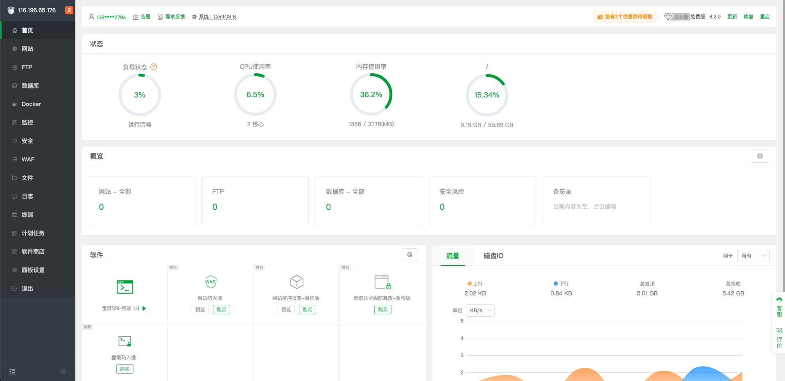
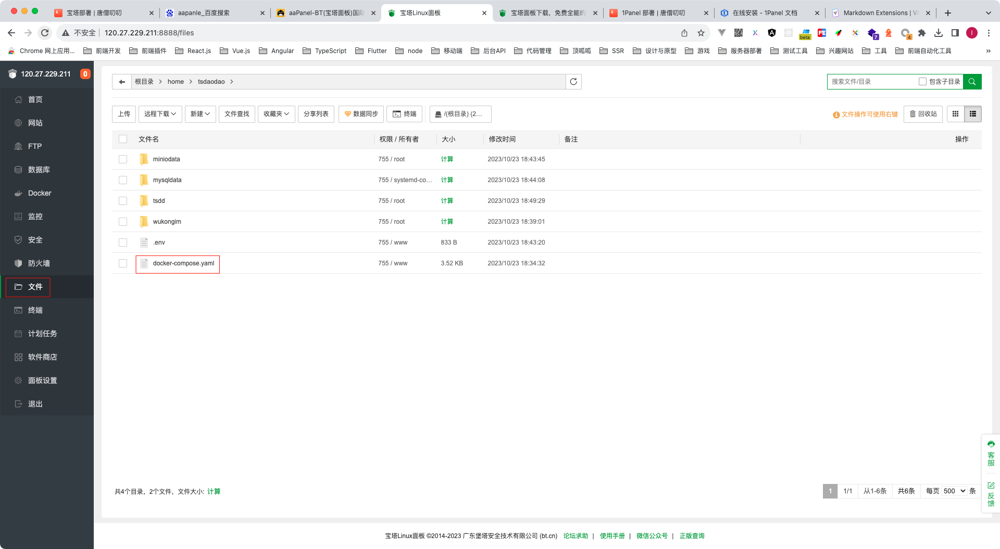
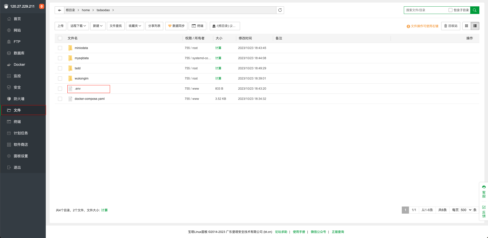
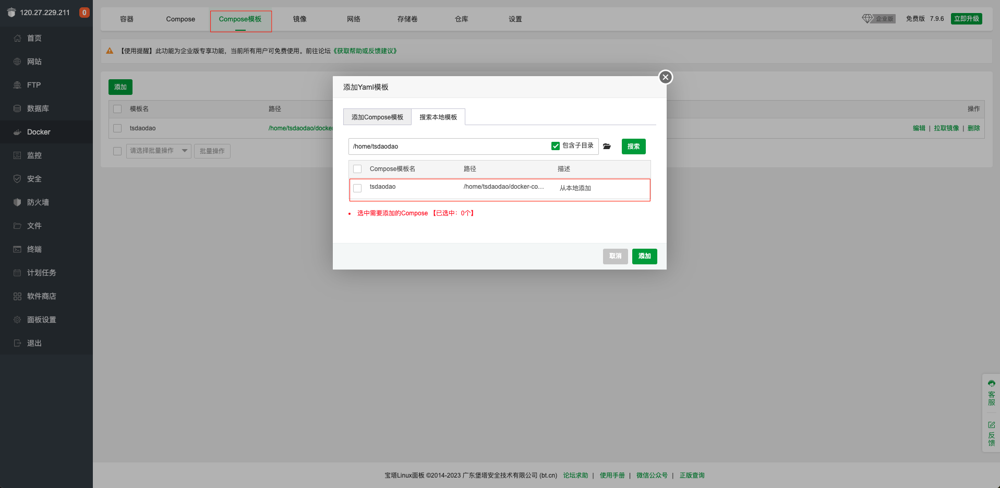
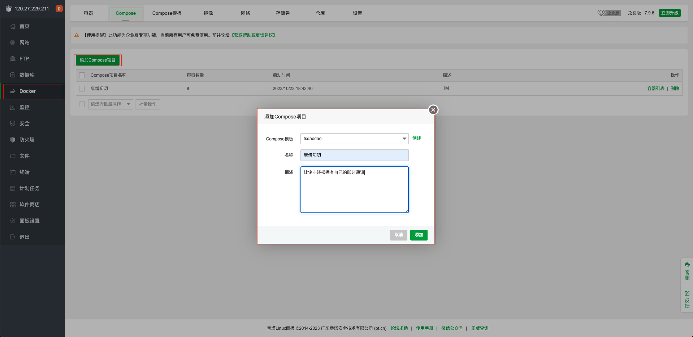
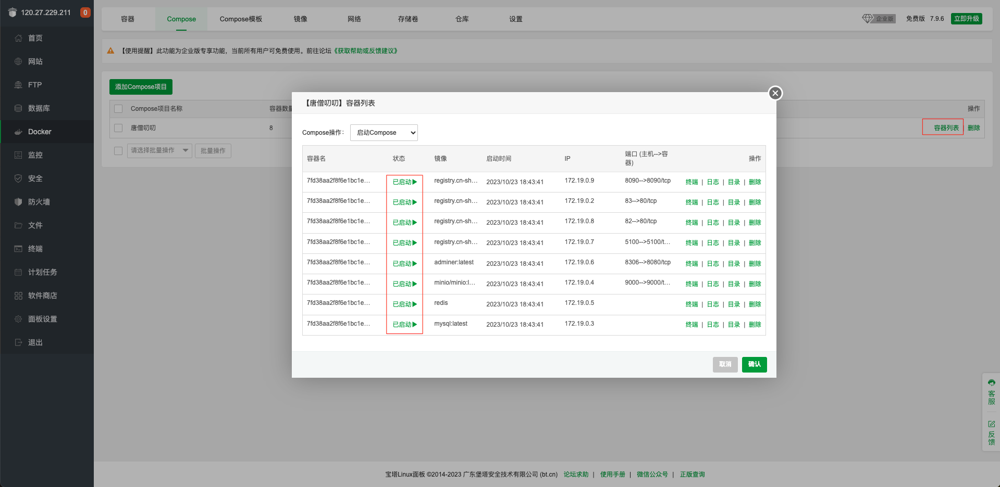

# 宝塔部署

## 安装宝塔

在线安装
::: code-group

```shell [RedHat/CentOS]
yum install -y wget && wget -O install.sh https://download.bt.cn/install/install_6.0.sh && sh install.sh ed8484bec
```

```shell [Ubuntu/Deepin]
wget -O install.sh https://download.bt.cn/install/install-ubuntu_6.0.sh && sudo bash install.sh ed8484bec
```

```shell [Debian]
wget -O install.sh https://download.bt.cn/install/install-ubuntu_6.0.sh && bash install.sh ed8484bec
```

```shell [国产龙芯]
wget -O install_panel.sh https://download.bt.cn/install/0/loongarch64/loongarch64_install_panel.sh && bash install_panel.sh ed8484bec
```

:::
关于宝塔的安装部署与基础功能介绍，请参考[宝塔官方文档](https://www.bt.cn/new/index.html)。在完成了宝塔的安装部署后，根据提示网址打开浏览器进入 宝塔，如下界面。



## 安装运行环境

安装 docker 和或 docker-compose


## 添加 TSDaoDao Compose 模版

::: info **文件导入创建 `TSDaoDao Compose` 模版**

1. 克隆 [https://github.com/TangSengDaoDao/appstore](https://github.com/TangSengDaoDao/appstore)

	``` sh
	git clone https://github.com/TangSengDaoDao/appstore.git
	```
2. 打开 `btpanel`目录
	``` sh
	cd btpanel
	```
3. 将 `tangsengdaodao` 目录，压缩 `tangsengdaodao.zip`
	``` sh
	zip tangsengdaodao.zip tangsengdaodao
	```
4. 将 `tangsengdaodao.zip` 上传到 `/home/tangsangdaodao` 目录
5. 在 `/home/tangsangdaodao` 目录，解压 `tangsengdaodao.zip`
	``` sh
	unzip tangsengdaodao.zip
	```
:::

1. 在 `/home` 目录新建文件 `tangsangdaodao`


2. 在`/home/tangsangdaodao`目录新建`docker-compose.yaml`

```yaml
version: "3.1"
services:
  wukongim:
    # 唐僧叨叨通讯服务（悟空IM）
    image: registry.cn-shanghai.aliyuncs.com/wukongim/wukongim:v1.2
    container_name: ${CONTAINER_NAME}-tsdd-wkim
    restart: always
    ports:
      - "5100:5100" # tcp长连接端口（外网开放）
      - "5200:5200" # websocket端口（外网开放）
      - "5300:5300" # 监控端口
    volumes:
      - ./wukongim:/root/wukongim
    env_file:
      - .env
    environment:
      - WK_EXTERNAL_IP=${EXTERNAL_IP}
  tangsengdaodaoserver:
    # 唐僧叨叨的业务服务
    image: registry.cn-shanghai.aliyuncs.com/wukongim/tangsengdaodaoserver:v1.5
    container_name: ${CONTAINER_NAME}-tsdd-serve
    restart: always
    command: "api"
    healthcheck:
      test: "wget -q -Y off -O /dev/null http://localhost:8090/v1/ping > /dev/null 2>&1"
      interval: 10s
      timeout: 10s
      retries: 3
    depends_on:
      - redis
      - mysql
      - wukongim
    ports:
      - "8090:8090"
    volumes:
      - ./tsdd/logs:/home/logs
    env_file:
      - .env
    environment:
      - TS_DB_MYSQLADDR=root:${MYSQL_ROOT_PASSWORD}@tcp(mysql)/${MYSQL_DATABASE}?charset=utf8mb4&parseTime=true&loc=Local
      - TS_EXTERNAL_IP=${EXTERNAL_IP}
      - TS_FILESERVICE=${TS_FILESERVICE}
      - TS_MINIO_ACCESSKEYID=${MINIO_ROOT_USER}
      - TS_MINIO_SECRETACCESSKEY=${MINIO_ROOT_PASSWORD}
  tangsengdaodaoweb:
    # 唐僧叨叨的web服务
    image: registry.cn-shanghai.aliyuncs.com/wukongim/tangsengdaodaoweb:latest
    container_name: ${CONTAINER_NAME}-tsdd-web
    restart: always
    environment:
      - API_URL=http://${EXTERNAL_IP}:8090/
    ports:
      - "82:80"
  tangsengdaodaomanager:
    # 唐僧叨叨的后台管理系统
    image: registry.cn-shanghai.aliyuncs.com/wukongim/tangsengdaodaomanager:latest
    container_name: ${CONTAINER_NAME}-tsdd-manager
    restart: always
    environment:
      - API_URL=http://${EXTERNAL_IP}:8090/
    ports:
      - "83:80"
  minio:
    # minio文件管理服务
    image: minio/minio:RELEASE.2024-04-06T05-26-02Z # use a remote image
    container_name: ${CONTAINER_NAME}-tsdd-minio
    expose:
      - "9000"
      - "9001"
    command: "server /data --console-address ':9001'"
    ports:
      - "9000:9000"
      - "9001:9001"
    environment:
      - MINIO_ROOT_USER=${MINIO_ROOT_USER}
      - MINIO_ROOT_PASSWORD=${MINIO_ROOT_PASSWORD}
    healthcheck:
      test: ["CMD", "curl", "-f", "http://localhost:9000/minio/health/live"]
      interval: 30s
      timeout: 20s
      retries: 3
    volumes:
      - ./miniodata:/data
  mysql:
    # mysql数据库
    image: mysql:8.0.33
    container_name: ${CONTAINER_NAME}-tsdd-mysql
    command: --default-authentication-plugin=mysql_native_password
    healthcheck:
      test: ["CMD", "mysqladmin", "ping", "-h", "localhost"]
    environment:
      - TZ=Asia/Shanghai
      - MYSQL_ROOT_PASSWORD=${MYSQL_ROOT_PASSWORD}
      - MYSQL_DATABASE=${MYSQL_DATABASE}
    ports:
      - 3306:3306
    volumes:
      - ./mysqldata:/var/lib/mysql
  redis:
    # redis
    image: redis:7.2.3
    container_name: ${CONTAINER_NAME}-tsdd-redis
    restart: always
    healthcheck:
      test: ["CMD", "redis-cli", "ping"]
      interval: 1s
      timeout: 3s
      retries: 30
  adminer:
    # mysql web管理工具 调试用，为了安全生产不要打开
    image: adminer:4.8.1
    container_name: ${CONTAINER_NAME}-tsdd-adminer
    ports:
      - 8306:8080
```



3. 在`/home/tangsangdaodao`目录新建`.env`

```shell
# ######### 基础配置 #########
# 容器名称
CONTAINER_NAME=my
# 服务器的对外IP地址
EXTERNAL_IP=xxx.xxx.xxx.xxx

# mysql root用户的密码
MYSQL_ROOT_PASSWORD=
# mysql默认数据库名字
MYSQL_DATABASE=im

# ######### Minio文件服务配置 #########

# minio文件服务的用户名
MINIO_ROOT_USER=minio
# minio文件服务的密码
MINIO_ROOT_PASSWORD=

######### WuKongIM相关的配置 #########

# 模式 debug or release
WK_MODE=release
 # 开启最近会话服务端维护
WK_CONVERSATION_ON=true
# 业务服务的grpc地址
WK_WEBHOOK_GRPCADDR=tangsengdaodaoserver:6979
# 业务服务的数据源地址
WK_DATASOURCE_ADDR=http://tangsengdaodaoserver:8090/v1/datasource
# 开启频道信息同步
WK_DATASOURCE_CHANNELINFOON=true
 # 开启token认证
WK_TOKENAUTHON=true
# 是否关闭个人白名单功能，默认是开启的，如果关闭发送消息将不做好友关系的判断
WK_WHITELISTOFFOFPERSON=false

######### TangSengDaoDao的配置 #########

#  模式 debug or release
TS_MODE=release
# wukongim的内网访问地址
TS_WUKONGIM_APIURL=http://wukongim:5001
# redis连接地址
TS_DB_REDISADDR=redis:6379
# 验证码，如果此值不为空，则使用此值作为验证码，为空则使用短信提供商发送的验证码
TS_SMSCODE=123456
# 使用文件服务的类型
TS_FILESERVICE=minio
# 默认头像获取地址
TS_AVATAR_DEFAULTBASEURL=https://api.multiavatar.com/{avatar}.png
# 唐僧叨叨后台管理系统的管理员密码,用户名为 superAdmin，可随机填写(至少8位)
TS_ADMINPWD=admin1234567
```

::: tip env 文件内，必须修改的参数

- EXTERNAL_IP：服务器的对外 IP 地址
- MYSQL_ROOT_PASSWORD：mysql 数据库的 root 用户密码，可随机填写
- MINIO_ROOT_PASSWORD：minio 文件服务的密码，可随机填写(至少 8 位)
- TS_SMSCODE：手机注册默认的短信验证码，默认值`123456`
- TS_ADMINPWD：唐僧叨叨后台管理系统的管理员密码,用户名为 `superAdmin`，可随机填写(至少 8 位)

:::



4. 添加`tsdaodao` Compose 模版



## 安装 TSDaoDao



## 访问 TSDaoDao

::: tip 提醒

- 查看可以[开放端口](./port)
:::

### 查看运行成功



### 访问悟空 IM 监控

::: tip 提醒

- 在浏览器访问地址：http:// IP + : +悟空 IM 监控端口 + /web
- 悟空 IM 监控端口：默认端口 5300
  :::


### 访问唐僧叨叨管理后台

::: tip 提醒

- 在浏览器访问地址：http:// IP + : + 唐僧叨叨管理后台端口
- 唐僧叨叨管理后台端口：默认端口 83
- 超级管理账号：superAdmin
- 密码：是在 `.env` 文件 `TS_ADMINPWD` 值，默认值是 `admin1234567`
:::

1. 登录界面


2. 登录成功


### 访问唐僧叨叨 WEB 端口

::: tip 提醒

- 在浏览器访问地址：http:// IP + : + 唐僧叨叨 WEB 端口
- 唐僧叨叨 WEB 端口：默认端口 83
:::

1. 在后台管理创建账号


2. 登录界面


3. 登录成功


