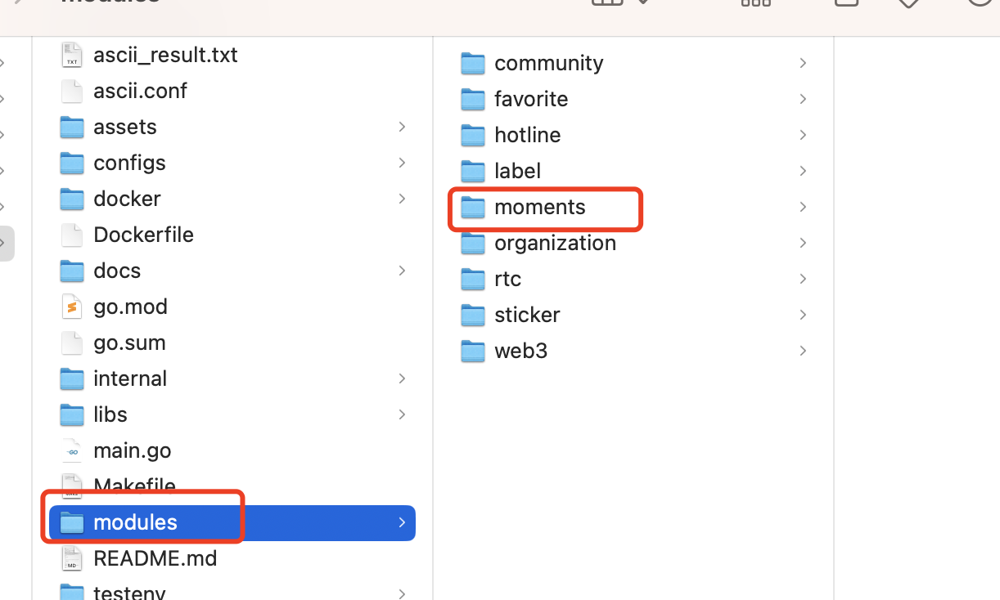
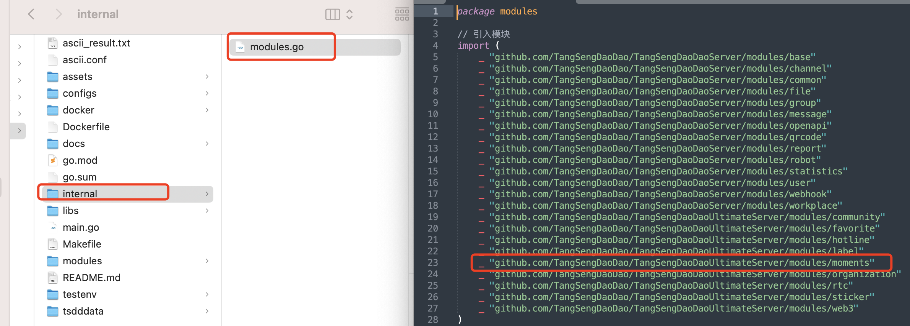

# 模块引入

以朋友圈模块(`moments`)为例，介绍如何引入模块。

## 第一步

将模块目录(`moments`)复制到项目的`modules`目录下。





## 第二步

在项目的`internal/modules.go`文件中添加模块的引入。

```go

import (
    ...
    _ "github.com/TangSengDaoDao/TangSengDaoDaoServer/modules/moments"
)

```



