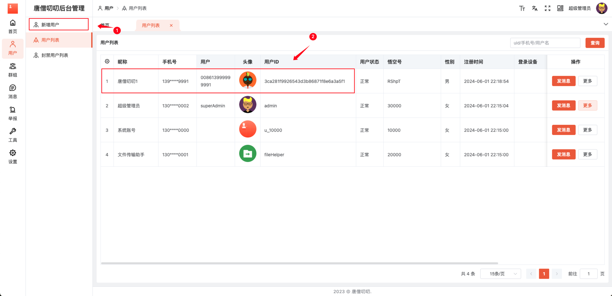

# Rainbond 部署

## 安装 Rainbond

### 在线安装

::: code-group

```shell [Linux & Mac]
curl -o install.sh https://get.rainbond.com && bash ./install.sh
```

```shell [Windows]
Invoke-WebRequest "https://get.rainbond.com/install-rainbond.ps1" -o install-rainbond.ps1 ; .\install-rainbond.ps1
```

``` shell [信创]
curl -o install.sh https://get.rainbond.com && bash ./install.sh

```
:::

关于 Rainbond 的安装部署与基础功能介绍，请参考 [Rainbond 官方文档](https://www.rainbond.com/)。在完成了 Rainbond 的安装部署后，根据提示网址打开浏览器进入 Rainbond，如下界面。


### Rainbond Cloud 部署

如果想在 “Rainbond” 上一键部署 “唐僧叨叨”，可以按照以下步骤进行操作

1. 打开 [唐僧叨叨应用详情](https://hub.grapps.cn/marketplace/apps/1676)


2. 登录**Rainbond Cloud**帐号

::: tip 提示
没有帐号，提前注册帐号！
:::


3. 选择**1.5.1**版本安装


## 安装 唐僧叨叨

1. 从应用市场安装，选择开源应用商店，选择**唐僧叨叨**应用安装。


2. 部署成功拓扑图


3. 在应用配置组管理编辑**tsdd-config**配置


4. 修改对外访问IP


5. 网关开发端口

::: tip 提醒
- 查看可以[开放端口](./port)
:::


## 访问 唐僧叨叨

### 1.访问悟空 IM 监控

::: tip 提醒

- 在浏览器访问地址：http:// IP + : +悟空 IM 监控端口 + /web
- 悟空 IM 监控端口：默认端口 5300
  :::


### 2.访问唐僧叨叨管理后台

::: tip 提醒

- 在浏览器访问地址：http:// IP + : + 唐僧叨叨管理后台端口
- 唐僧叨叨管理后台端口：默认端口 83
  :::

1. 登录界面


2. 查看超级管理员帐号并进行登录


3. 登录成功


### 3.访问唐僧叨叨 WEB 端口

::: tip 提醒

- 在浏览器访问地址：http:// IP + : + 唐僧叨叨 WEB 端口
- 唐僧叨叨 WEB 端口：默认端口 83
  :::

1. 在后台管理创建账号



2. 登录界面


3. 登录成功

