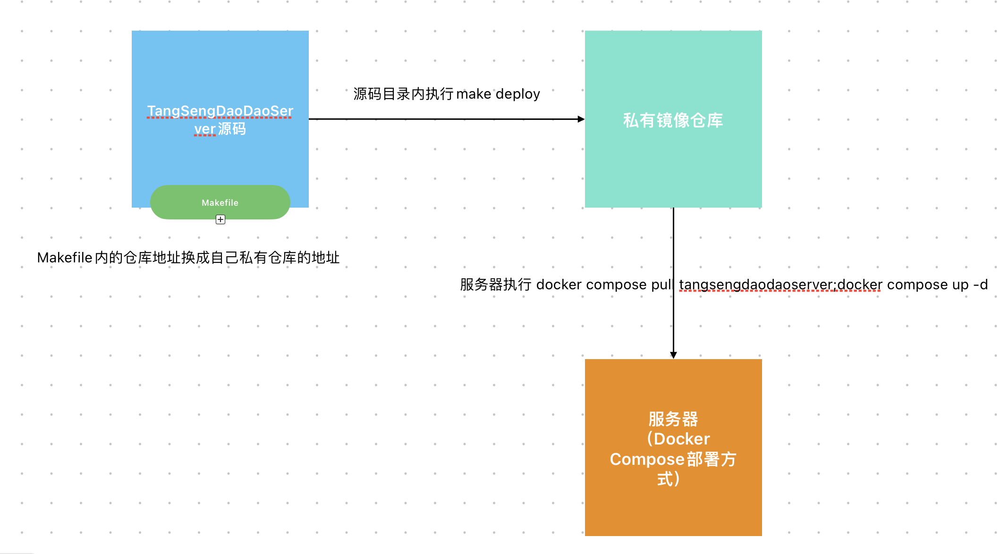

# 推荐二次开发流程

1. 将项目根目录下的`Makefile`文件的镜像仓库地址修改成你自己私有参考的镜像仓库地址。

2. 修改服务器上的`docker-compose.yaml`文件中的 `tangsengdaodaoserver`服务的`image`字段，将镜像仓库地址修改成你自己私有参考的镜像仓库地址。

3. 修改代码后，项目根目录下执行 `make deploy` (如果不支持make命令可以将Makefile里的deploy部分的命令拿出来一条条执行) 命令，命令会将代码编译成镜像并推送到镜像仓库。

4. 进入服务器在docker-compose.yaml文件目录下执行 `docker compose pull tangsengdaodaoserver;docker compose up -d` 命令，命令会拉取最新镜像并重启服务。

`注意 老版本的docker-compose命令是docker-compose，新版本的docker-compose命令是docker compose`