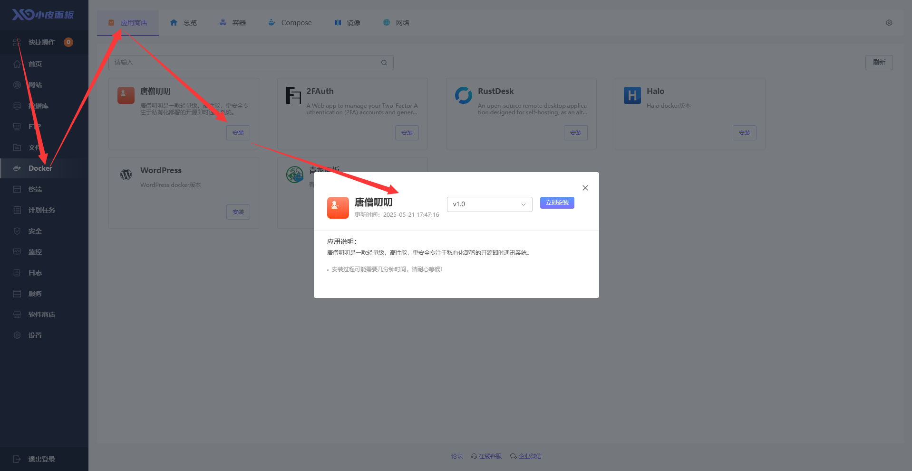

# 小皮面板部署

## 安装小皮面板

在线安装
::: code-group

```shell [RedHat/CentOS]
sudo curl -O https://dl.xp.cn/dl/xp/install.sh && sudo bash install.sh
```

```shell [Ubuntu/Debian]
sudo wget -O install.sh https://dl.xp.cn/dl/xp/install.sh && sudo bash install.sh
```

```shell [通用脚本/其他]
## 第一步：安装 docker
if [ -f /usr/bin/curl ];then curl -O https://dl.xp.cn/dl/xp/install.sh;else wget -O install.sh https://dl.xp.cn/dl/xp/install.sh;fi;bash install.sh
```

:::

关于 小皮面板 的安装部署与基础功能介绍，请参考 [小皮面板 官方文档](https://doc.xp.cn/linux)。在完成了 小皮面板 的安装部署后，根据提示网址打开浏览器进入 小皮面板，如下界面。


## 安装 Docker


Docker 安装完成后刷新页面

## 一键安装 唐僧叨叨

1. 点击左侧 Docker > 应用商店 > 唐僧叨叨 > 安装



2. 安装结束后输出相关信息，注意保存


3. 点击左侧 安全 > 系统防火墙 > 端口配置 > 添加端口配置 来放行需要的端口（比如 82 和 83）


## 访问唐僧叨叨

::: tip 提醒

- 出于安全考虑 mysql、redis 等均运行在 Docker 内部的网络中，外部不可访问，只暴露了 wukongim、tangsengdaodaoweb、tangsengdaodaomanager、adminer 的端口
- 查看[端口说明](./port)
  :::

### 1.访问悟空 IM 监控

::: tip 提醒

- 在浏览器访问地址：http:// IP + : +悟空 IM 监控端口 + /web
- 悟空 IM 监控端口：默认端口 5300
  :::


### 2.访问唐僧叨叨管理后台

::: tip 提醒

- 在浏览器访问地址：http:// IP + : + 唐僧叨叨管理后台端口
- 唐僧叨叨管理后台端口：默认端口 83
  :::

1. 登录界面（账号 superAdmin，密码在之前的安装信息中）


2. 登录成功


3. 在后台管理创建账号


### 3.访问唐僧叨叨 WEB 端口

::: tip 提醒

- 在浏览器访问地址：http:// IP + : + 唐僧叨叨 WEB 端口
- 唐僧叨叨 WEB 端口：默认端口 83
  :::

2. 登录界面


3. 登录成功


