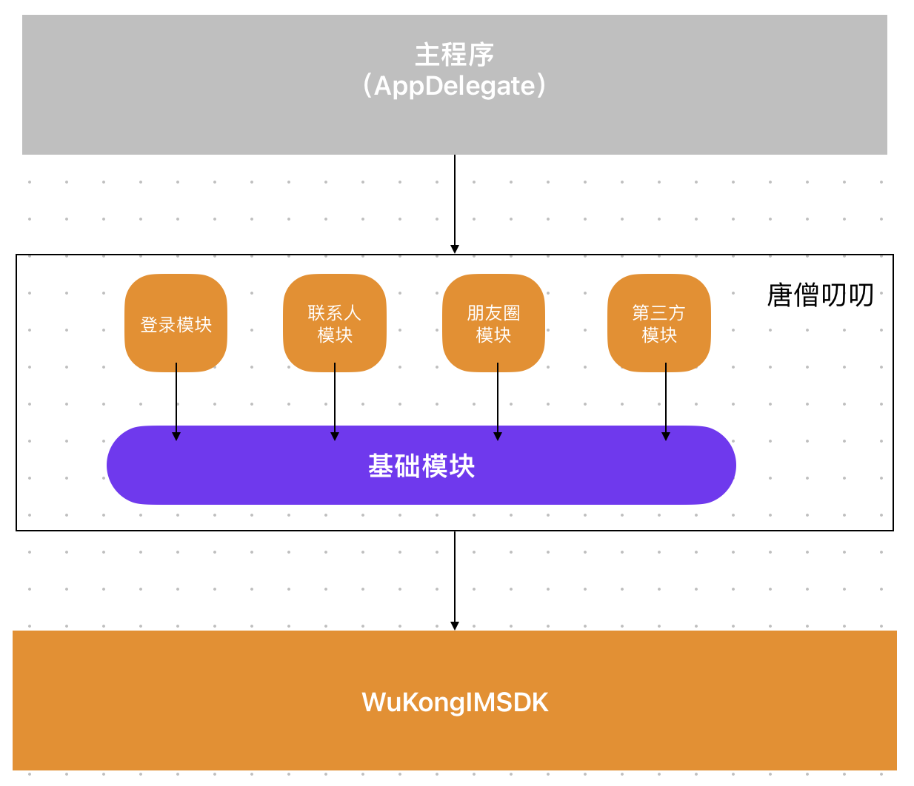

# 介绍

唐僧叨叨iOS采用模块化开发，每个模块都是一个独立的pod，可以单独使用，也可以组合使用。设计达到的目的就是在Podfile一句配置就能引入模块 例如 `pod 'WuKongLogin', :path => './Modules/WuKongLogin'  ##  登录模块` 无需在做其他修改。

## 项目架构

1. 项目启动骨架 依赖 唐僧叨叨层。

2. 唐僧叨叨内部其他模块都依赖基础模块，多个模块组成唐僧叨叨层。

3. 唐僧叨叨通讯层依赖[悟空IM](https://githubim.com)