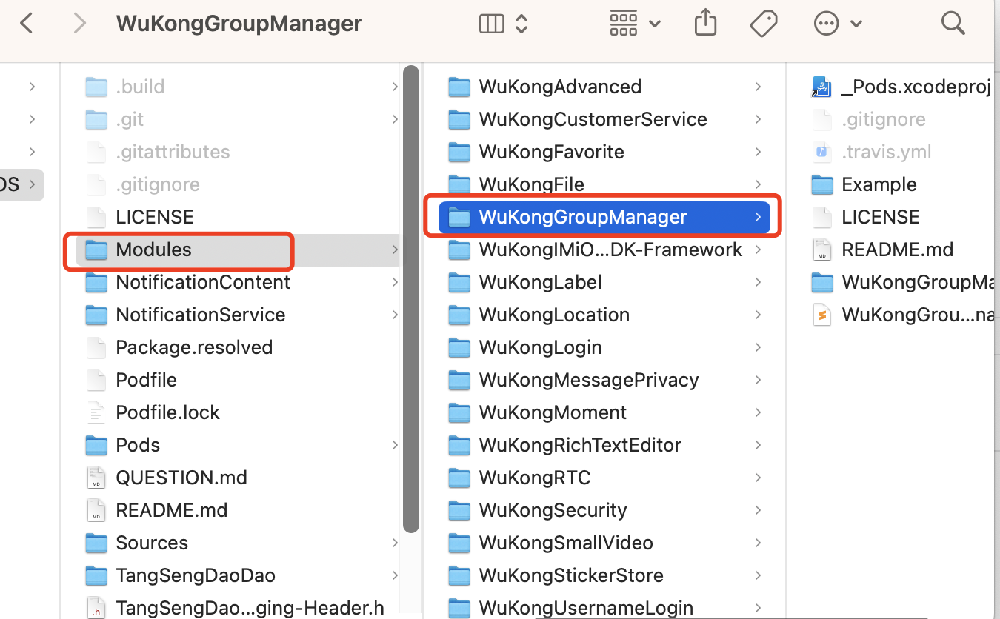
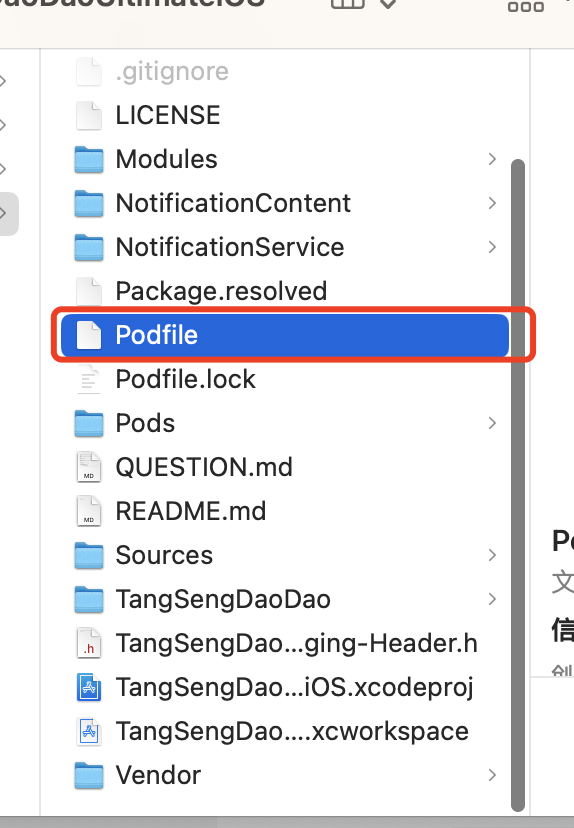

# 模块引入

以群管理模块(`WuKongGroupManager`)为例，介绍如何引入模块。

## 第一步

将模块目录(`WuKongGroupManager`)复制到项目的`Modules`目录下。





## 第二步

在项目的`Podfile`文件中添加模块的引入。

```ruby

pod 'WuKongGroupManager', :path => './Modules/WuKongGroupManager'  ## 群管理

```



## 第三步

在项目根目录下执行`pod install`命令，然后打开`TangSengDaoDaoiOS.xcworkspace`文件。运行项目，验证模块是否引入成功。