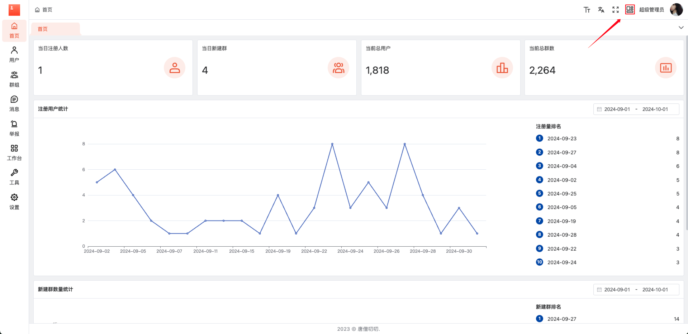
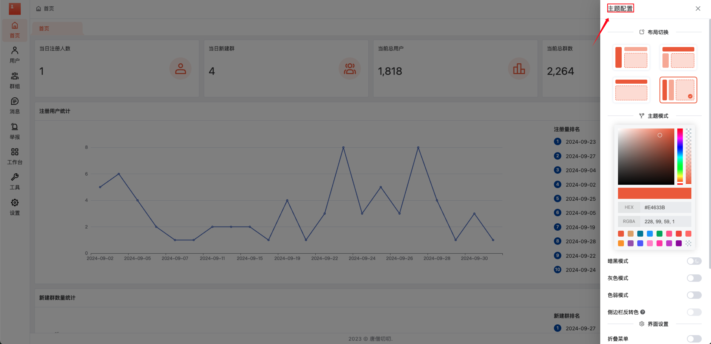
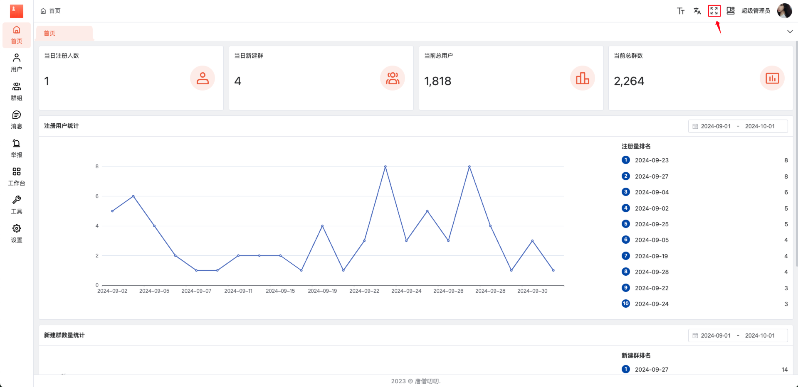
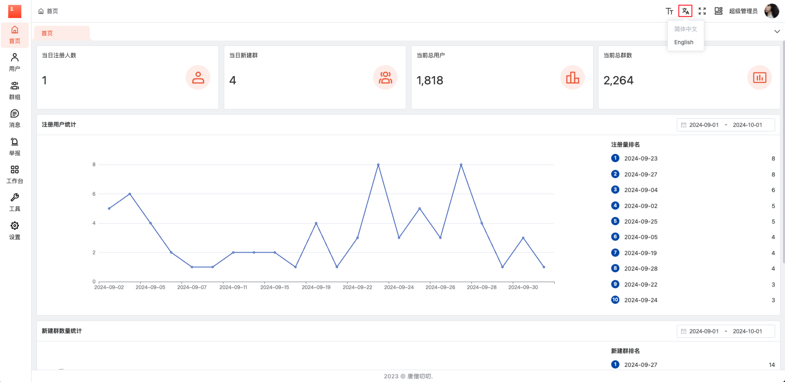
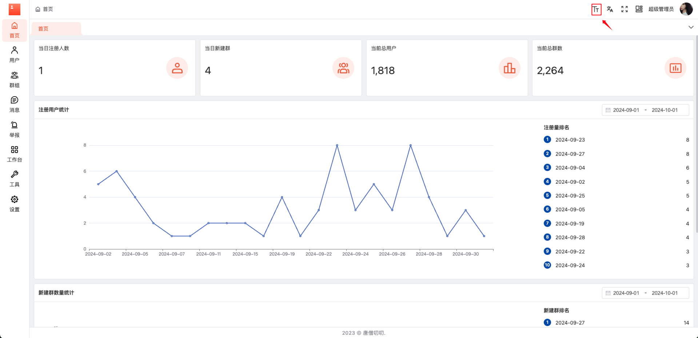
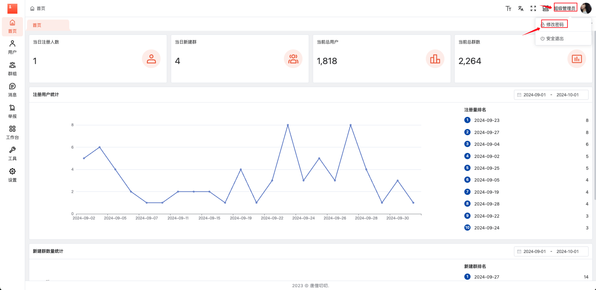
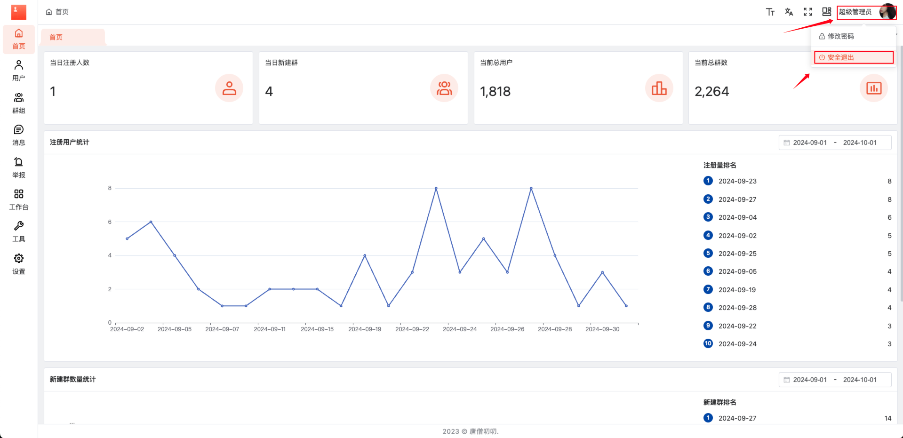

# 通用功能

## 1.主题配置

点击页面右上方主题配置按钮，进行布局切换、主题模式、界面设置，设置。

主题配置弹框

## 2.全屏/退出全屏

点击页面右上方全屏/退出全屏钮，进行全屏、退出全屏功能操作。

## 3.切换语言

点击页面右上方的语言下拉菜单，进行指定语言的切换

## 4.切换字体大小

点击页面右上方的字体下拉菜单，进行指定字体大小的切换

## 5.修改密码

点击页面右上方用户名处的下拉菜单中，选择【修改密码】选项，页面将会跳到修改密码页面

## 6.安全退出

点击页面右上方用户名处的下拉菜单中，选择【安全退出】选项，页面将会跳到登录页面

