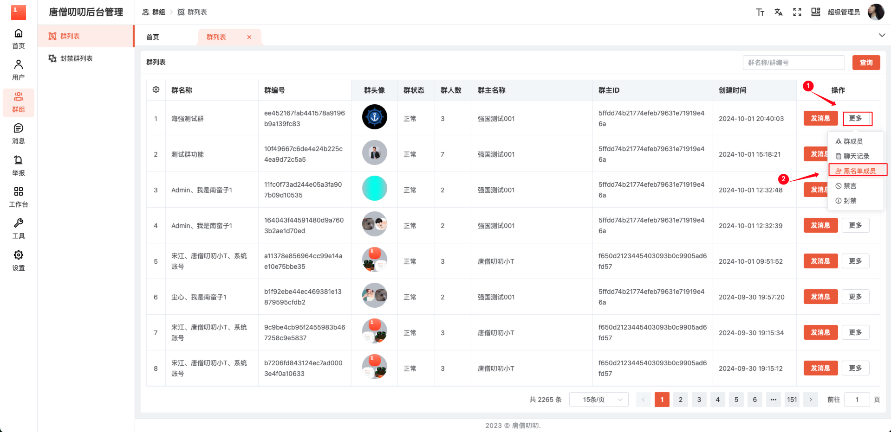

# 群管理

查看群列表及群的信息（群名称、群编号、群头像】群状态、群人数、群主名称、群主ID、创建时间）；发消息、群成员、聊天记录、黑名单成员、禁言、封禁操作。

## 1. 群列表

点击【群列表】菜单，查看群列表。

## 2. 发消息

通过群主给群发消息，在【群列表】页面，选择需要操作的群，点击【发消息】按钮，弹出发送消息弹框，进行发消息操作。

在发送消息弹框，编辑发送消息内容，点击【发送】按钮，群主给群发消息。

## 3. 群成员

在群列表页面，选择需要的操作的群，鼠标移入【更多】按照，在下拉框点击【群成员】按钮，跳转该群的【群成员】页面。

### 3.1 群成员列表

查看该群的群成员及群的信息（用户昵称、用户ID、用户头像、成员角色、群内备注、入群时间）；成员给该群发消息、移除成员操作。

### 3.2 发信息

在群成员列表，选择需要的成员，点击【发消息】按钮，弹出发送消息弹框，进行发消息操作。

在发送消息弹框，编辑发送消息内容，点击【发送】按钮，通过成员给群发消息。

### 3.3 移除

在群成员列表，选择需要的成员，点击【移除】按钮，弹出提示弹框， 点击【确定】按照，进行移除成员操作。

## 4. 聊天记录

在群列表页面，选择需要的操作的群，鼠标移入【更多】按照，在下拉框点击【聊天记录】按钮，跳转该群的【聊天记录】页面。

### 4.1 聊天记录列表

查看该群聊天记录及聊天信息（消息编号、发送者名字、发送者ID、发送者头像、消息内容、是否撤回、是否删除、发送时间）；删除操作。

### 4.2 删除

在群聊天记录页面，选择需要删除聊天记录，点击【删除】按钮，弹出提示弹框，点击【确定】按钮删除该聊天记录。

## 5. 黑名单成员

在群列表页面，选择需要的操作的群，鼠标移入【更多】按照，在下拉框点击【黑名单成员】按钮，跳转该群的【黑名单成员】页面。

### 5.1 黑名单成员列表

查看该群黑名单成员及黑名单成员信息（头像、用户昵称、用户ID、操作者、备注、拉入黑名单时间）。

## 6. 禁言

在群列表页面，选择需要的操作的群，鼠标移入【更多】按照，在下拉框点击【禁言】按钮，弹出禁言弹框。

在禁言弹框，点击【确定】按钮，对该群进行禁言。

## 7. 封禁

在群列表页面，选择需要的操作的群，鼠标移入【更多】按照，在下拉框点击【封禁】按钮，弹出封禁弹框。

在封禁弹框，点击【确定】按钮，对该群进行封禁。

