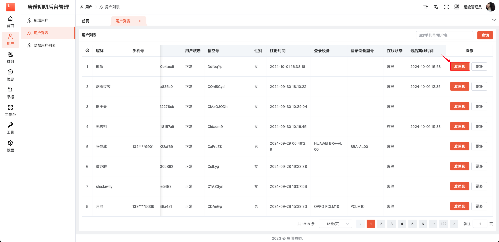
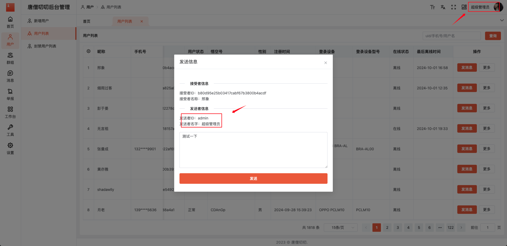
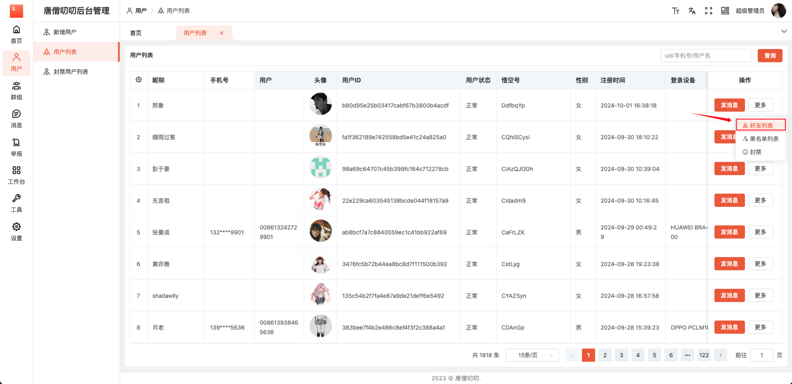

# 用户列表

查看用户信息（昵称、手机号、用户、头像、用户ID、用户状态、悟空号、性别、注册时间、登录设备、登录设备型号、在线状态、最后离线时间），对用户发消息、查看好友列表 、查看黑名单列表、封禁操作。

## 1. 发消息

点击【用户列表】菜单，选择用户进行发消息。

通过登录账号，发送系统消息

## 2. 好友列表

选择用户，鼠标移入【更多】按钮，下拉框选择【好友列表】，点击跳转该用户【好友列表】页面，进行查看该用户的好友列表

### 2.1 查看好友

### 2.2 查看好友聊天记录

### 2.3 删除记录

## 3. 黑名单列表

## 4. 封禁
