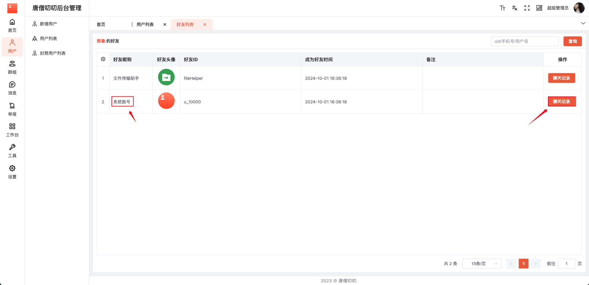
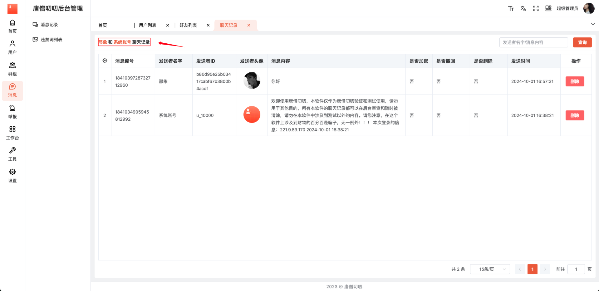
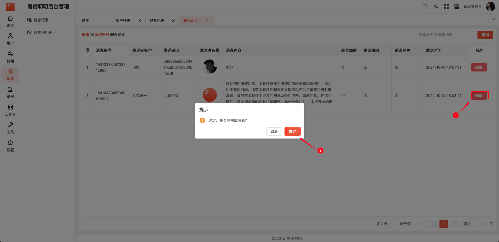
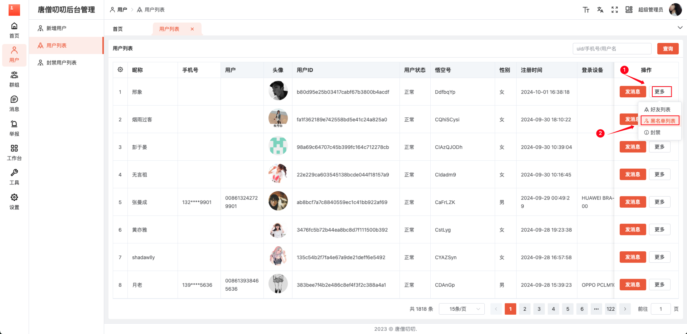
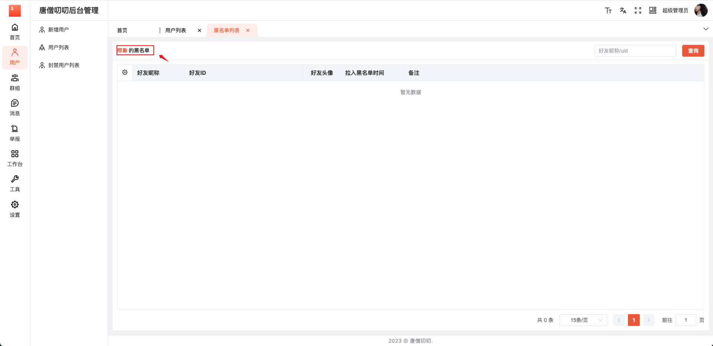
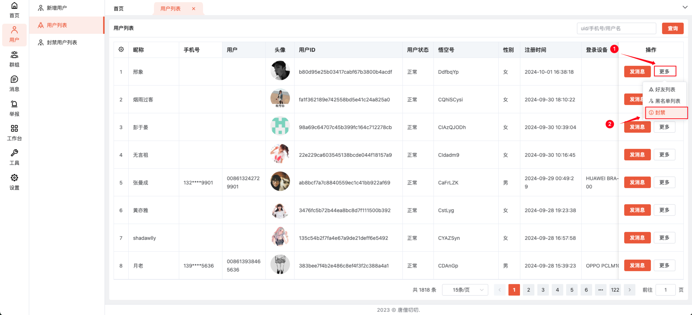
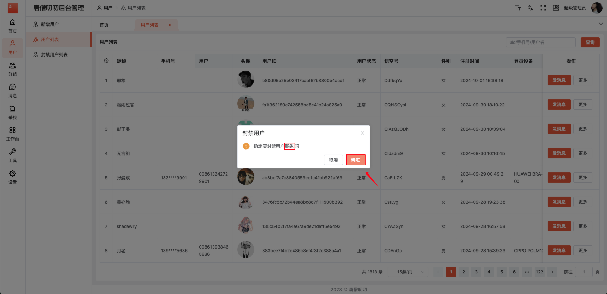

# 用户列表

查看用户信息（昵称、手机号、用户、头像、用户ID、用户状态、悟空号、性别、注册时间、登录设备、登录设备型号、在线状态、最后离线时间），对用户发消息、查看好友列表 、查看黑名单列表、封禁操作。

## 1. 发消息

点击【用户列表】菜单，选择用户进行发消息。

通过登录账号，发送系统消息。

## 2. 好友列表

查看用户的好友，选择用户，鼠标移入【更多】按钮，下拉框选择【好友列表】，点击跳转该用户【好友列表】页面，进行查看该用户的好友列表。

### 2.1 查看好友

查看用户的好友及好友信息（好友昵称、好友头像、好友ID、成为好友时间、备注）；与好友的聊天记录操作。

### 2.2 查看好友聊天记录

查看与该好友的聊天记录，在【好友列表】选择查看好友，点击【聊天记录】按钮, 跳转与该好友【聊天记录】页面。

### 2.3 聊天记录

查看与好友的聊天记卢及聊天信息（消息编号、发送者名称、发送者ID、发送者头像、消息内容、是否加密、是否撤回、是否删除、发送时间），删除记录操作。

### 2.3 删除记录

在与该好友的聊天记录页面，选择需要删除的记录，点击【删除】按钮，弹出提示弹框，点击【确定】按钮删除该与好友聊天记录。

## 3. 黑名单

查看用户的黑名单列表，选择用户，鼠标移入【更多】按钮，下拉框选择【黑名单列表】，点击跳转该用户【黑名单列表】页面，进行查看该用户的黑名单列表。

### 3.1 黑名单列表

查看用户的黑名单列表及黑名单的基本信息（好友昵称、好友ID、好友头像、拉入黑名单时间、备注）

## 4. 封禁

对用户进行封禁操作，在【用户列表】页面，选择需要封禁操作，鼠标移入【更多】按钮，下拉框选择【封禁】，弹出封禁用户弹框，点击【确定】按钮操作。

弹出封禁用户弹框，进行封禁用户操作。

