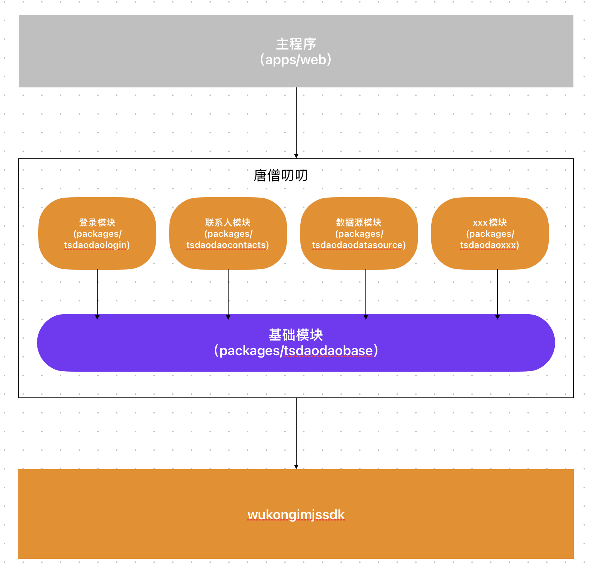

# 介绍

唐僧叨叨Web采用模块化开发，每个模块都是一个独立的npm项目。

引入模块只需要在主骨架里的`index.tsx`一句话引入，比如引入登录模块 `WKApp.shared.registerModule(new LoginModule())`

## 项目架构

1. 项目主程序 依赖 唐僧叨叨层。

2. 唐僧叨叨内部其他模块都依赖基础模块，多个模块组成唐僧叨叨层。

3. 唐僧叨叨通讯层依赖[wukongimjssdk](https://githubim.com/sdk/javascript.html)
