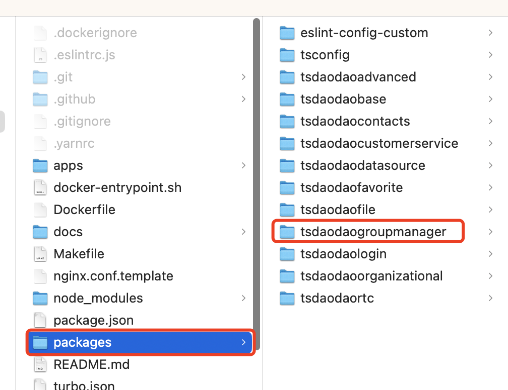
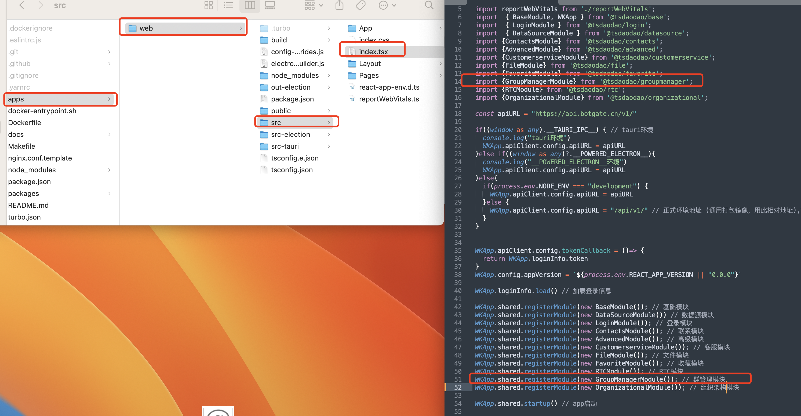

# 模块引入

以群管理模块(`tsdaodaogroupmanager`)为例，介绍如何引入模块。

## 第一步

将模块目录(`tsdaodaogroupmanager`)复制到项目的`packages`目录下。





## 第二步

在项目的`apps/web/package.json`文件中添加模块的引入。

```json

{
    ...
    "@tsdaodao/groupmanager": "*",
    ...
}

```

如下图：


## 第三步

注册模块

在项目的`apps/web/src/index.tsx`文件中添加模块的引入。

```typescript

import { GroupManagerModule } from '@tsdaodao/groupmanager';

...

WKApp.shared.registerModule(new GroupManagerModule()); // 群管理模块

```

如下图：



## 第四步

在项目根目录下执行`yarn install`命令，然后运行项目(`yarn run dev`)，验证模块是否引入成功。